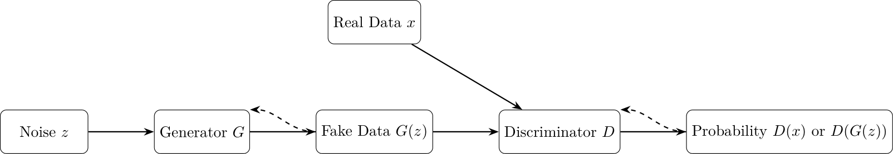

# Generative Adversarial Networks (GANs)

## Overview
Generative Adversarial Networks (GANs), introduced by Ian Goodfellow et al. in 2014, consist of a **generator** that creates synthetic data from noise and a **discriminator** that distinguishes real from fake data. They train adversarially, converging when generated data mimics the real distribution. GANs excel in producing sharp images (e.g., faces) but face challenges like training instability and mode collapse.

**Key Strengths**:
- Sharp, realistic outputs.
- Flexible for images, audio, etc.
- Enables style transfer and data augmentation.

**Key Weaknesses**:
- Unstable training.
- Mode collapse.
- High computational cost.

**Seminal Papers**:
- Goodfellow et al., 2014, "Generative Adversarial Nets" [arXiv:1406.2661](https://arxiv.org/abs/1406.2661)
- Radford et al., 2015, "Unsupervised Representation Learning with DCGANs" [arXiv:1511.06434](https://arxiv.org/abs/1511.06434)
- Karras et al., 2019, "A Style-Based Generator Architecture for GANs" [arXiv:1812.04948](https://arxiv.org/abs/1812.04948)

## Theoretical Background

GANs represent a significant paradigm shift in generative modeling, framing the training process as a two-player minimax game between a generator network and a discriminator network.

### Adversarial Framework

As Goodfellow et al. (2014) explained in their groundbreaking paper, "The generative model can be thought of as analogous to a team of counterfeiters, trying to produce fake currency and use it without detection, while the discriminative model is analogous to the police, trying to detect the counterfeit currency" [1].

The mathematical formulation of this game is:

$\min_G \max_D V(D, G) = \mathbb{E}_{x \sim p_{data}(x)}[\log D(x)] + \mathbb{E}_{z \sim p_z(z)}[\log(1 - D(G(z)))]$

where:
- $G$ is the generator that maps noise $z$ to data space
- $D$ is the discriminator that outputs a probability that its input is real
- $p_{data}$ is the data distribution
- $p_z$ is the noise distribution (typically Gaussian)

### Theoretical Guarantees

Goodfellow et al. proved that for an optimal discriminator, training the generator minimizes the Jensen-Shannon divergence between the real and generated distributions. However, as Arjovsky and Bottou (2017) pointed out, "When the generator and discriminator are optimal, the Jensen-Shannon divergence achieves its minimum value of 0, which happens when the generated distribution exactly matches the data distribution" [2].

### Training Dynamics

GAN training exhibits several unique characteristics:

1. **Non-convergence**: As the discriminator improves, the generator's gradient can vanish, leading to oscillations rather than convergence.

2. **Mode collapse**: The generator may learn to produce only a limited variety of samples, as described by Metz et al. (2016): "The generator rotates through a small set of output types as the discriminator cycles through focusing on different types of flaws" [3].

3. **Balancing act**: Successful training requires carefully balancing the power of the generator and discriminator. According to Salimans et al. (2016), "If the discriminator is too good, then generator training can fail as the gradient vanishes" [4].

### Major Variants

Several important GAN variants have emerged:

1. **DCGAN** (Radford et al., 2015): Introduced architectural guidelines for stable GAN training with convolutional networks [5].

2. **WGAN** (Arjovsky et al., 2017): Replaced the Jensen-Shannon divergence with the Wasserstein distance to improve training stability [6].

3. **StyleGAN** (Karras et al., 2019): Incorporated style transfer principles to enable fine-grained control over generation [7].

4. **BigGAN** (Brock et al., 2019): Scaled up GANs to unprecedented sizes, demonstrating the importance of batch size and model capacity [8].

## Architecture

[Download GAN Architecture](../images/gan_architecture.png)

## Algorithm
```pseudocode
Algorithm: Train_GAN
Input: Real dataset D, noise dimension z_dim, learning rate lr, epochs E
Output: Trained generator G and discriminator D

1. Initialize G and D with random weights
2. For each epoch in E:
    a. For each batch in D:
        i. Sample real data x from D
        ii. Sample noise z from N(0,1)
        iii. Generate fake data: x_fake = G(z)
        iv. Compute discriminator loss:
            L_D = -mean(log(D(x))) - mean(log(1 - D(x_fake)))
        v. Update D weights to minimize L_D
        vi. Compute generator loss:
            L_G = -mean(log(D(x_fake)))
        vii. Update G weights to minimize L_G
3. Return G, D
```

## Advanced Training Techniques

Several techniques have been developed to stabilize GAN training:

1. **Feature matching** (Salimans et al., 2016): "Instead of directly maximizing the discriminator's output, the generator is trained to match the statistics of features on an intermediate layer of the discriminator" [4].

2. **Spectral normalization** (Miyato et al., 2018): "Normalizing the spectral norm of the weight matrices in the discriminator stabilizes training by controlling its Lipschitz constant" [9].

3. **Progressive growing** (Karras et al., 2018): "Starting with low-resolution images and progressively increasing resolution during training enables stable learning of high-resolution image generation" [10].

4. **Differentiable augmentation** (Zhao et al., 2020): "Applying the same differentiable augmentation to both real and generated samples improves training with limited data" [11].

## Applications

GANs have found applications across numerous domains:

- **Image-to-image translation**: Pix2Pix (Isola et al., 2017) and CycleGAN (Zhu et al., 2017) enable transformations between image domains [12, 13].
- **Super-resolution**: SRGAN (Ledig et al., 2017) generates photorealistic high-resolution images from low-resolution inputs [14].
- **Art generation**: StyleGAN-based models have enabled creative tools like ArtBreeder and DALL-E.
- **Data augmentation**: GANs can generate synthetic training data to improve classifier performance.

## Code
[Download GAN Code](../code/gan_mnist.py)

This implementation uses PyTorch to generate MNIST digits. Run it with:
```bash
python code/gan_mnist.py
```

## Additional References

[1] Goodfellow, I., Pouget-Abadie, J., Mirza, M., Xu, B., Warde-Farley, D., Ozair, S., ... & Bengio, Y. (2014). "Generative Adversarial Nets" [arXiv:1406.2661](https://arxiv.org/abs/1406.2661)

[2] Arjovsky, M., & Bottou, L. (2017). "Towards Principled Methods for Training Generative Adversarial Networks" [arXiv:1701.04862](https://arxiv.org/abs/1701.04862)

[3] Metz, L., Poole, B., Pfau, D., & Sohl-Dickstein, J. (2016). "Unrolled Generative Adversarial Networks" [arXiv:1611.02163](https://arxiv.org/abs/1611.02163)

[4] Salimans, T., Goodfellow, I., Zaremba, W., Cheung, V., Radford, A., & Chen, X. (2016). "Improved Techniques for Training GANs" [arXiv:1606.03498](https://arxiv.org/abs/1606.03498)

[5] Radford, A., Metz, L., & Chintala, S. (2015). "Unsupervised Representation Learning with Deep Convolutional Generative Adversarial Networks" [arXiv:1511.06434](https://arxiv.org/abs/1511.06434)

[6] Arjovsky, M., Chintala, S., & Bottou, L. (2017). "Wasserstein Generative Adversarial Networks" [arXiv:1701.07875](https://arxiv.org/abs/1701.07875)

[7] Karras, T., Laine, S., & Aila, T. (2019). "A Style-Based Generator Architecture for Generative Adversarial Networks" [arXiv:1812.04948](https://arxiv.org/abs/1812.04948)

[8] Brock, A., Donahue, J., & Simonyan, K. (2019). "Large Scale GAN Training for High Fidelity Natural Image Synthesis" [arXiv:1809.11096](https://arxiv.org/abs/1809.11096)

[9] Miyato, T., Kataoka, T., Koyama, M., & Yoshida, Y. (2018). "Spectral Normalization for Generative Adversarial Networks" [arXiv:1802.05957](https://arxiv.org/abs/1802.05957)

[10] Karras, T., Aila, T., Laine, S., & Lehtinen, J. (2018). "Progressive Growing of GANs for Improved Quality, Stability, and Variation" [arXiv:1710.10196](https://arxiv.org/abs/1710.10196)

[11] Zhao, S., Liu, Z., Lin, J., Zhu, J. Y., & Han, S. (2020). "Differentiable Augmentation for Data-Efficient GAN Training" [arXiv:2006.10738](https://arxiv.org/abs/2006.10738)

[12] Isola, P., Zhu, J. Y., Zhou, T., & Efros, A. A. (2017). "Image-to-Image Translation with Conditional Adversarial Networks" [arXiv:1611.07004](https://arxiv.org/abs/1611.07004)

[13] Zhu, J. Y., Park, T., Isola, P., & Efros, A. A. (2017). "Unpaired Image-to-Image Translation using Cycle-Consistent Adversarial Networks" [arXiv:1703.10593](https://arxiv.org/abs/1703.10593)

[14] Ledig, C., Theis, L., Huszár, F., Caballero, J., Cunningham, A., Acosta, A., ... & Shi, W. (2017). "Photo-Realistic Single Image Super-Resolution Using a Generative Adversarial Network" [arXiv:1609.04802](https://arxiv.org/abs/1609.04802)