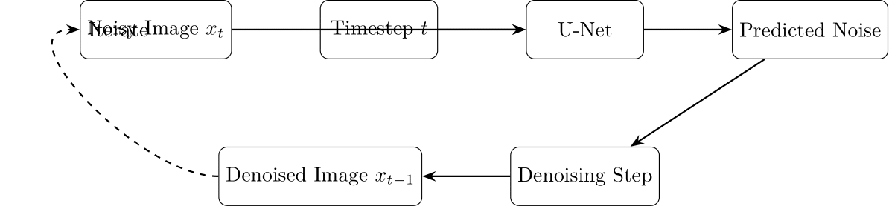
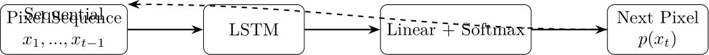

# Comprehensive Tutorial on Generative AI

## Overview

This tutorial covers five key Generative AI approaches:

1. Generative Adversarial Networks (GANs)
2. Variational Autoencoders (VAEs)
3. Transformers
4. Diffusion Models
5. Autoregressive Models

# Generative Adversarial Networks (GANs)

## Concept & Architecture

- **Two-player minimax game**: Generator vs Discriminator
- **Generator**: Creates fake data from random noise
- **Discriminator**: Distinguishes real from fake data
- **Training**: Adversarial process where both networks improve

{width=60%}

## Key Features & Variants

**Key Features**:
- Excellent at generating high-resolution, sharp images
- Challenging to train (mode collapse, instability)
- No explicit density modeling

**Notable Variants**:
- DCGAN: Deep Convolutional GANs
- WGAN: Wasserstein GANs
- StyleGAN: Style-based Generator Architecture

## Mathematics & Training

**Objective Function**:
$$\min_G \max_D V(D, G) = \mathbb{E}_{x \sim p_{data}}[\log D(x)] + \mathbb{E}_{z \sim p_z}[\log(1 - D(G(z)))]$$

**Training Process**:
1. Train D to maximize real/fake classification
2. Train G to minimize D's ability to detect fakes
3. At convergence, G produces data indistinguishable from real

# Variational Autoencoders (VAEs)

## Concept & Architecture

- **Encoder**: Maps inputs to latent distribution (μ, σ)
- **Sampling**: Apply reparameterization trick for backprop
- **Decoder**: Reconstructs data from latent samples
- **Loss**: Balances reconstruction quality with KL divergence

{width=60%}

## Key Features & Variants

**Key Features**:
- Well-structured, continuous latent space
- Stable training process
- Often produces blurrier outputs than GANs

**Notable Variants**:
- β-VAE: Controls disentanglement with weight on KL term
- VQ-VAE: Uses vector quantization in latent space
- Conditional VAE: Incorporates conditional information

## Mathematics & Training

**VAE Objective (ELBO)**:
$$\mathcal{L}(\theta, \phi; x) = \mathbb{E}_{q_\phi(z|x)}[\log p_\theta(x|z)] - D_{KL}(q_\phi(z|x) || p(z))$$

**Reparameterization Trick**:
$$z = \mu + \sigma \odot \epsilon, \quad \epsilon \sim \mathcal{N}(0, I)$$

# Transformers

## Concept & Architecture

- **Self-Attention**: Core mechanism for token relationships
- **Multi-Head Attention**: Attends to different aspects
- **Positional Encoding**: Provides sequence order information
- **Autoregressive Decoding**: For text generation

{width=60%}

## Key Features & Applications

**Key Features**:
- Excellent at capturing long-range dependencies
- Scales effectively with more data and parameters
- Powers modern LLMs (GPT, LLaMA, etc.)

**Applications**:
- Text generation
- Machine translation
- Code completion
- Image generation (with adaptations)

## Mathematics & Attention

**Attention Mechanism**:
$$\text{Attention}(Q, K, V) = \text{softmax}\left(\frac{QK^T}{\sqrt{d_k}}\right)V$$

**Multi-Head Attention**:
$$\text{MultiHead}(Q, K, V) = \text{Concat}(\text{head}_1, \ldots, \text{head}_h)W^O$$

# Diffusion Models

## Concept & Process

- **Forward Process**: Gradually add noise to data
- **Reverse Process**: Learn to denoise step by step
- **Training**: Predict noise at each timestep
- **Sampling**: Iteratively denoise from random noise

{width=60%}

## Key Features & Variants

**Key Features**:
- High-quality, diverse outputs
- Stable training compared to GANs
- Slower generation due to iterative process

**Notable Variants**:
- DDPM: Denoising Diffusion Probabilistic Models
- DDIM: Accelerated sampling through non-Markovian paths
- Latent Diffusion: Operates in compressed latent space

## Mathematics & Training

**Forward Process**:
$$q(x_t|x_{t-1}) = \mathcal{N}(x_t; \sqrt{1-\beta_t}x_{t-1}, \beta_t\mathbf{I})$$

**Reverse Process Training Objective**:
$$L_{simple} = \mathbb{E}_{t, x_0, \epsilon}[||\epsilon - \epsilon_\theta(x_t, t)||^2]$$

# Autoregressive Models

## Concept & Architecture

- **Sequential Generation**: One element at a time
- **Conditional Modeling**: Each output depends on previous ones
- **Applications**: Images (PixelCNN), Audio (WaveNet), Text

{width=60%}

## Key Features & Variants

**Key Features**:
- Explicit probability modeling
- High-quality details
- Flexible for various sequential data

**Notable Variants**:
- PixelCNN: Masked convolutions for images
- PixelRNN: RNN-based autoregressive models
- WaveNet: Dilated convolutions for audio

## Mathematics & Training

**Autoregressive Probability**:
$$p(x) = \prod_{i=1}^{n} p(x_i | x_1, x_2, ..., x_{i-1})$$

**Training Objective**:
$$L = -\sum_{i} \log p(x_i | x_{<i}; \theta)$$

# Comparison & Applications

## Strengths & Weaknesses

| Model | Strengths | Weaknesses |
|-------|-----------|------------|
| GANs | Sharp images, Fast inference | Training instability, Mode collapse |
| VAEs | Stable training, Structured latent space | Blurry outputs, Less realistic |
| Transformers | Excellent for text, Scales well | High computational cost, Hallucinations |
| Diffusion | High-quality outputs, Stable training | Slow inference, Complex implementation |
| Autoregressive | Explicit probability, High-quality details | Slow generation, High memory usage |

## Real-World Applications

- **GANs**: Photo editing, Art generation (DALL-E, Midjourney)
- **VAEs**: Anomaly detection, Drug discovery, Image manipulation
- **Transformers**: Text generation (ChatGPT), Translation, Code completion
- **Diffusion**: Image generation (Stable Diffusion), Text-to-image
- **Autoregressive**: Image/audio synthesis, Text completion, Time series

# Resources & Conclusion

## Further Resources

**Code Examples**:
- All models implemented in PyTorch
- MNIST examples for image models
- Simulated text for Transformer

**Documentation**:
- Detailed explanations in `/docs/`
- Code implementations in `/code/`
- Architecture diagrams in `/images/`

## Thank You!

Explore the full tutorial at:
- Documentation: `/docs/`
- Code: `/code/`
- Images: `/images/`

Prerequisites: Python 3.8+, PyTorch 2.0+, and related libraries
