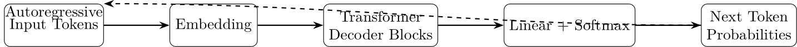

# Transformers (Autoregressive for Text)

## Overview
Transformers, introduced by Vaswani et al. in 2017, use self-attention for sequence modeling, excelling in text generation. Autoregressive transformers (e.g., GPT) predict the next token given previous ones, enabling coherent text. They scale to large models but require significant compute and data.

**Key Strengths**:
- Excellent for text and code generation.
- Supports zero-shot learning.
- Scales with large datasets.

**Key Weaknesses**:
- High computational cost.
- Risk of hallucinations.
- Slow for long sequences.

**Seminal Papers**:
- Vaswani et al., 2017, "Attention is All You Need" [arXiv:1706.03762](https://arxiv.org/abs/1706.03762)
- Radford et al., 2019, "Language Models are Unsupervised Multitask Learners" [OpenAI Blog](https://openai.com/blog/better-language-models/)
- Kaplan et al., 2020, "Scaling Laws for Neural Language Models" [arXiv:2001.08361](https://arxiv.org/abs/2001.08361)

## Architecture

[Download Transformer Architecture](../images/transformer_architecture.png)

## Algorithm
```pseudocode
Algorithm: Train_Transformer
Input: Text dataset T, vocabulary V, learning rate lr, epochs E
Output: Trained transformer model

1. Initialize transformer model with random weights
2. Tokenize T into sequences of tokens
3. For each epoch in E:
    a. For each batch of sequences in T:
        i. Compute output logits for next token prediction
        ii. Compute cross-entropy loss: L = CE(logits, target_tokens)
        iii. Update model weights to minimize L
4. Return transformer
```

## Code
[Download Transformer Code](../code/transformer_text.py)

This implementation generates token sequences. Run it with:
```bash
python code/transformer_text.py
```