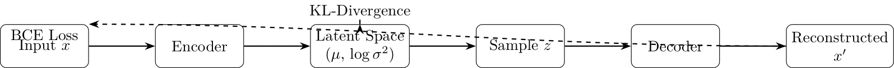

# Variational Autoencoders (VAEs)

## Overview
Variational Autoencoders (VAEs), introduced by Kingma and Welling in 2013, learn a probabilistic latent space for data generation. An encoder maps inputs to a latent distribution, and a decoder reconstructs or generates data. VAEs use the reparameterization trick for training, balancing reconstruction and regularization. They produce smooth outputs but may be blurry compared to GANs.

**Key Strengths**:
- Structured latent space for interpolation.
- Stable training.
- Suitable for denoising and synthetic data.

**Key Weaknesses**:
- Blurry outputs.
- Limited for complex distributions.
- Less realistic than GANs.

**Seminal Papers**:
- Kingma & Welling, 2013, "Auto-Encoding Variational Bayes" [arXiv:1312.6114](https://arxiv.org/abs/1312.6114)
- Higgins et al., 2017, "β-VAE: Learning Basic Visual Concepts" [arXiv:1606.05579](https://arxiv.org/abs/1606.05579)
- Sohn et al., 2015, "Conditional Variational Autoencoders" [arXiv:1511.03383](https://arxiv.org/abs/1511.03383)

## Architecture

[Download VAE Architecture](../images/vae_architecture.png)

## Algorithm
```pseudocode
Algorithm: Train_VAE
Input: Dataset D, latent dimension z_dim, learning rate lr, epochs E
Output: Trained VAE model

1. Initialize encoder E and decoder D with random weights
2. For each epoch in E:
    a. For each batch in D:
        i. Sample data x from D
        ii. Encode: (mu, logvar) = E(x)
        iii. Reparameterize: z = mu + epsilon * exp(0.5 * logvar), epsilon ~ N(0,1)
        iv. Decode: x_recon = D(z)
        v. Compute loss:
            L = BCE(x_recon, x) + KL(-0.5 * (1 + logvar - mu^2 - exp(logvar)))
        vi. Update E and D weights to minimize L
3. Return VAE
```

## Code
[Download VAE Code](../code/vae_mnist.py)

This implementation generates MNIST digits. Run it with:
```bash
python code/vae_mnist.py
```